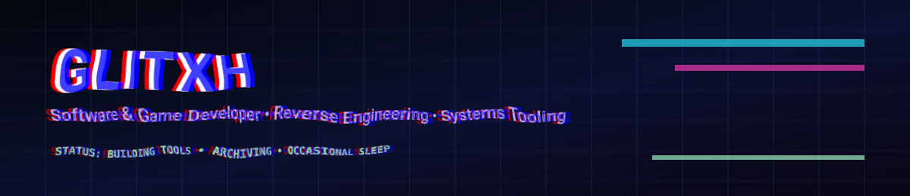
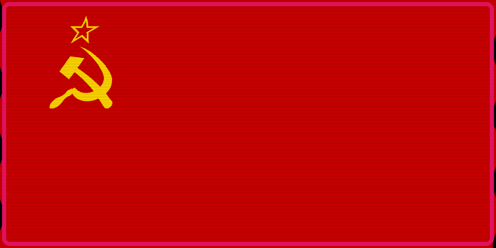
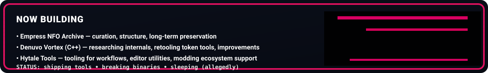

 

  

  
  
  
  
  
  

---

## About Me

**Software & Game Developer • Reverse Engineering • Systems Tooling**

I build practical software, take stubborn binaries apart, and ship tooling that is meant to be used, not just demoed.

**Based in the former Soviet Union.**

  

---

## Now Building

### Current Active Work

- **Mirai Discord Bot** — currently building and expanding **Mirai** for **The Vortex** Discord server, with work focused on moderation tooling, utility features, workflow improvements, and cleaner server-side automation.
- **GUI Steam Ticket Generator** — actively developing a desktop-oriented GUI version with a cleaner interface, better usability, and a more polished workflow than terminal-only tooling.
- **Upcoming GUI Utilities** — next planned desktop tools are a **GUI-based Ubisoft Ticket Generator** and **GUI-based EA Ticket Generator**, following the same more accessible, desktop-first approach.

---

## Current Focus

- **Mirai for The Vortex** — building out a stronger Discord bot and server utility stack.
- **Steam Ticket Generator GUI** — pushing toward a cleaner and more usable desktop workflow.
- **Ubisoft / EA GUI Tools** — planning the next phase of GUI-based tooling.
- **Empress NFO Archive** — maintaining and curating a long-term archive with better organization and usability: https://empressvoicesnfo.github.io/
- **Hytale Tools** — continuing work on tooling for Hytale-related workflows and modding ecosystems.

---

## Featured Releases

---

## Philosophy

> Reverse engineering is not about breaking things.  
> It is about building accurate mental models, writing tooling that respects reality,  
> and shipping improvements that hold up under pressure — not just in ideal demos.

---

## Pinned Projects

---

## GitHub Activity

---

  

