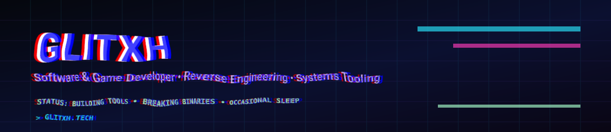
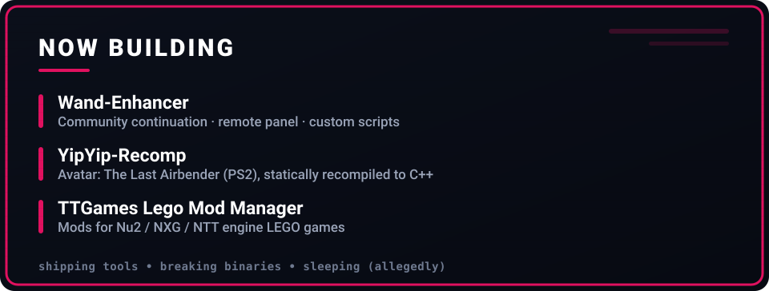

 

  

  
  
  
  
  
  
  
  

---

## About Me

**Software & Game Developer • Reverse Engineering • Systems Tooling**

I build practical software, take stubborn binaries apart, and ship tooling that is meant to be used, not just demoed.

**Based in the former Soviet Union.** More of me lives at **[glitxh.tech](https://glitxh.tech)**.

  

---

## Now Building

- **[Wand-Enhancer](https://github.com/Glitxhhh/Wand-Enhancer)** — maintained community continuation of the WandEnhancer interoperability/UX tool, with a LAN remote web panel, custom script injection and reproducible builds from source.
- **[YipYip-Recomp](https://github.com/Glitxhhh/YipYip-Recomp)** — static recompilation of *Avatar: The Last Airbender* (PS2) into native C++. Very early, heavily W.I.P.
- **[TTGames Lego Mod Manager](https://github.com/Glitxhhh/TTGamesLegoModManager)** — install, enable and combine mods for TT Games LEGO titles across the Nu2, NXG and NTT engines.
- **[Fortnite AFK XP Monitor](https://github.com/Glitxhhh/FortniteAFKXPMonitor)** — cross-platform .NET 10 + Avalonia utility for AFK XP sessions on Windows and Linux.
- **[WidgetCord](https://github.com/Glitxhhh/WidgetCord)** — keeps a Discord profile widget auto-updated from a live data source, with a small web panel.

---

## How I Work Now

My workflow has shifted from doing everything by hand to **AI-assisted reverse engineering and development**:

- **MCP-driven RE** — Ghidra, x64dbg and IDA Pro all wired up to LLM tooling through MCP servers ([ghidra-mcp](https://github.com/Glitxhhh/ghidra-mcp), [x64dbgMCP](https://github.com/Glitxhhh/x64dbgMCP), [IDAssistMCP](https://github.com/Glitxhhh/IDAssistMCP)), so analysis, renaming and batch operations happen at conversation speed.
- **Claude Code in the loop** — agents handle the repetitive scaffolding, refactors and cross-file changes; I stay on architecture, verification and the parts that need real judgement.
- **Linux-first desktop** — daily driving CachyOS, building native Qt6/C++ and Avalonia tools that work on Wayland instead of being Windows-only.
- **Ship, then iterate** — small public repos from day one so progress is visible, even when there's no demo yet.

---

## Featured Projects

| Project | What it is |
| --- | --- |
| [**Wand-Enhancer**](https://github.com/Glitxhhh/Wand-Enhancer) | Advanced UX and interoperability extension for the Wand (WeMod) app. |
| [**SRCWUnlocker**](https://github.com/Glitxhhh/SRCWUnlocker) | Lightweight DLL-based unlocker for Sonic Racing CrossWorlds. |
| [**SmokeAPI**](https://github.com/Glitxhhh/SmokeAPI) | Legit DLC unlocker for Steamworks. |
| [**XStoreUnlocker**](https://github.com/Glitxhhh/XStoreUnlocker) | DLC unlocker for Microsoft Store and Xbox PC games. |
| [**DepotDumperGUI**](https://github.com/Glitxhhh/DepotDumperGUI) | Mass depot key dumper built on SteamKit2, with a GUI. |
| [**discord-quest-completer**](https://github.com/Glitxhhh/discord-quest-completer) | Windows desktop app to complete Discord quests without installing the games. |
| [**CachyAutoClicker**](https://github.com/Glitxhhh/CachyAutoClicker) | Native C++/Qt6 auto-clicker for Wayland using `uinput`. |
| [**HytaleAvatarEditor**](https://github.com/Glitxhhh/HytaleAvatarEditor) | Edit Hytale avatar params while offline. |
| [**p3rpc.hermitrewrittencheatsheetpatch**](https://github.com/Glitxhhh/p3rpc.hermitrewrittencheatsheetpatch) | Persona 3 Reload cheat sheet patch — [GameBanana](https://gamebanana.com/mods/616284). |
| [**persona5proto**](https://persona5proto.github.io/) | Persona 5 prototype archive and website. |

---

## Philosophy

> Reverse engineering is not about breaking things.  
> It is about building accurate mental models, writing tooling that respects reality,  
> and shipping improvements that hold up under pressure — not just in ideal demos.

---

## Pinned Projects

---

## Support My Work

If something I made saved you time, you can support its development:

Crypto addresses (click to expand)

| Chain | Address |
| --- | --- |
| Bitcoin | `bc1qnwtms7pp8hdfqnuunvs3juwskgu7tartd532pz` |
| Ethereum | `0x48240481C69904C35EC41B4f4eBE41Af05D81975` |
| Solana | `8gLiGa61utSAyqRGy4QtoVzP6BNkL3GjQZZBpuRtY8hK` |
| Tron (USDT-TRC20) | `TDgQTrr4i3ivJQtQpYB5M3nEw92VkAmC6D` |

The Ethereum address is the same wallet on Linea, Base, BNB Chain, Polygon, Optimism, Arbitrum and Arc — double-check your wallet is on the network you mean to send on before confirming. The Tron address works for native TRX too, not just USDT-TRC20. USDC has no address of its own: send it as a token on any of the networks above.

---

## GitHub Activity

---

  

